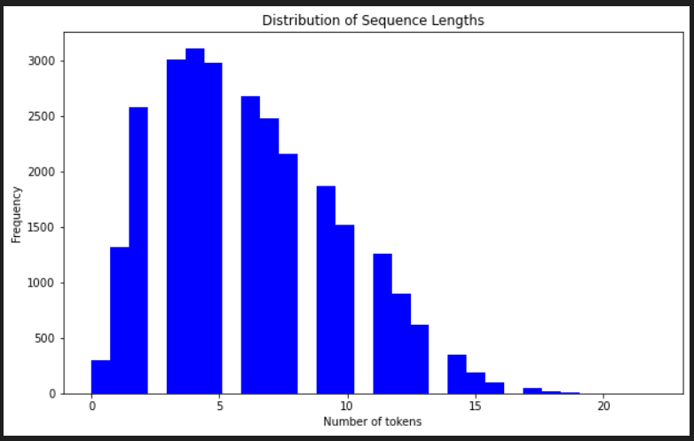

# X entiment Analysis

## Introduction

Sentiment analysis is a technique used to determine the emotional tone from remarks or comments that users of certain application either X, facebook, instagram or tiktok about a certain topic.

This remarks can have a positive tone, neutral tone and negative tone towards a certain audience.

## Business Understanding

### Background

X is a popular social media platform that most people use to share their opinions about certain topics, this can either be political, religious or social trends.

These opinions can be positive, negative or neutral towards the topic been addressed. These opinions are mainly in text format.

### Problem statement

Due to the growing amount of user-generated content on X, it is becoming more difficult for researchers, corporation to accurately and efficiently gauge public opinion on particular subjects, goods, or occasions. It's challenging to glean useful data from tweets because of their sheer number and informal style, which frequently includes slang, acronyms, and emoticons. This leads to inadequate insights generated by corporations from public opinion to improve certain products or when advertising certain products.

### Objective

1. Develop a sentiment analysis model that uses natural preprocessing language(nlp) to preprocess and clean the tweets, and make it in a more structured format for sentiment analysis.

2. Use the sentiment analysis model that can accurately classify tweets into positive, negative and neutral sentiment categories.

3. Evaluate Performance: Measure the model's accuracy, precision, recall, and F1-score on a labeled dataset, and iteratively improve based on evaluation results.

### Conclusion

Although emojis, acronyms, and slang are common on Twitter, the informal tone of the network makes it difficult to draw meaningful conclusions from user-generated content. While sophisticated NLP models and neural network approaches, handle the complexity of sentiment grouping, preprocessing is essential to cleanse this noisy data.

## Data Understanding

### Text Preprocessing

The text preprocessing step aims to clean the raw text data to ensure it is in a suitable format for modeling. This involves:

- Lowercasing all the text to ensure uniformity.

- Removing special characters, punctuation, and URLs that are not useful for sentiment classification.

- Tokenization, where each tweet is broken down into individual words or tokens.

- Stopwords removal, eliminating common words (like "the", "is", etc.) that don't carry much semantic value.

- Padding, where we ensure that each sequence (tweet) has the same length by adding zeros to shorter tweets or truncating longer ones. This helps standardize the input for machine learning models.

### Tokenization and Padding

After preprocessing, we convert the cleaned text data into sequences of numerical tokens using a tokenizer. Each word in the dataset is assigned a unique integer value. This transformation allows us to feed the data into machine learning models.

Given that tweet lengths can vary significantly, we apply padding to make all sequences uniform.

### Visualizations

1. **Class Distribution**

This bar chart illustrates the distribution of sentiment classes in the dataset. We observe that the dataset is slightly imbalanced, with more neutral tweets compared to positive and negative tweets.

2. **Distribution of Sequence Lengths**

The histogram shows the distribution of tweet lengths in terms of the number of tokens. Most tweets in the dataset contain fewer than 10 tokens, with the majority being between 5 and 10 tokens long.